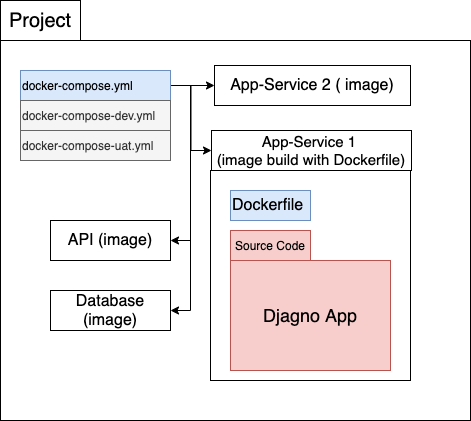

# Ch01 Docker

This chapter contain note for use Django with docker and basic Django warm up.

## 1. Docker, Container basic

Check private docker note or search online.

## 2. Hello world

Create Hello world Django project

### Review

```bash
# Create project and migrate
> djagno-admin startproject hello_project
> python manage.py migrate
> python manage.py runserver

# Create page app
> python manage.py startapp pages
```

- Add `‘pages.app.PagesConfig’` in `INSTALL_APPS` at `setting.py`
- Update project-level urls.py and app-level urls.py
  
    ```python
    # pages/urls.py
    ...
    urlpatterns = [
        path('', home_page_view, name='home')
    ]
    ```
  
- Setting base `HttpResponse` in `pages/views.py`
  
    ```python
    # pages/views.py
    from django.http import HttpResponse
    
    def home_page_view(request):
        return HttpResponse('Hello, Worlds!!')
    ```
  
## 3. Image, Container, and Docker Host

### Dockerfile of Django project

```docker
# base image
FROM python:3.9-alpine

# Set environment variables
ENV PYTHONDONTWRITEBYTECODE 1
ENV PYTHONUNBUFFERED 1

# Set work dir
WORKDIR /code

# Install package
COPY Pipfile Pipfile.lock /code/
RUN pip install pipenv && pipenv install --system

# Copy project
COPY src/. /code/
```

1. Environment
    - **PYTHONUNBUFFERED** ensures our console output looks familiar and is not buffered
    by Docker, which we don’t want.
    - **PYTHONDONTWRITEBYTECODE** means Python will not try to write .pyc files which we also do not desire
2. Pipenv with —system
  
    use `—system` to install vm’s package in system( docker image)
  
### Docker compose

In this section I use self define docker-compose.yml with override docker-compose-dev.yml which include source code mount.

```yaml
# docker-compose.yml
version: '3.8'

services:
  web:
    build: helloworld/.
    command: python /code/manage.py runserver 0.0.0.0:8000
    volumes:
      - ./helloworld/src:/code
    ports:
      - 8000:8000

# docker-compose-dev.yml
services:
  web:
    volumes:
      - ./helloworld/src:/code
```

## 3. My Docker Structure

My Design to place docker-compose, Dockerfile, and Project


