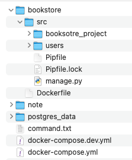

# Ch03 Bookstore project Custom User

## 1. Create Environment

File structure



Dockerfile

```docker
FROM python:3.9-alpine

ENV PYTHONDONTWRITEBYTECODE 1
ENV PYTHONUNBUFFERED 1

WORKDIR /code

COPY src/Pipfile src/Pipfile.lock /code/
RUN pip install pipenv && pipenv install --system

COPY src/. /code/
```

Docker-compose and Develop docker-compose for project

- In base compose file, use build image with environment value.
- In develop compose file, bind port, set volumes, and self network.

```yaml
# docker-compose.yml
version: '3.9'

services:
  web:
    image: ch03_web
    command: python /code/manage.py runserver 0.0.0.0:8000
    environment:
      - POSTGRES_NAME=postgres
      - POSTGRES_USER=postgres
      - POSTGRES_PASSWORD=postgres
    depends_on:
      - db

  db:
    image: postgres:11
    environment:
      - POSTGRES_NAME=postgres
      - POSTGRES_USER=postgres
      - POSTGRES_PASSWORD=postgres
```

```yaml
# docker-compose.dev.yml
version: '3.9'

services:
  web:
    build: bookstore/.
    volumes:
      - ./bookstore/src:/code
    ports:
      - 8001:8000
    networks:
      - dev-network

  db:
    volumes:
      - ./postgres_data:/var/lib/postgresql/data/
    networks:
      - dev-network

networks:
  dev-network:
    driver: bridge
```

## 2. Create project and database connection

Same as previous chapter, make change  DATABASES in setting.py

## 3. Custom User Model

There are two way to custom user model, either extend `AbstractUser` which keeps the default User fields and permissions or extend `AbstractBaseUser` which is even more granular, and flexible, but requires more work.

In this project, we stay with `AbstractUser` for simple.

There are 4 steps for adding custom user model to our project

1. Create a `CustomUser` model
2. Update `setting.py`
3. Customize `UserCreateForm` and `UserChangeForm`
4. Add the custom user model to `admin.py`

First, create user app and modify user model

```bash
> docker-compose exec web python manage.py startapp users
```

```python
# users/models.py
from django.contrib.auth.models import AbstracUser
from django.db import models

class CustomUser(AbstractUser):
    pass
```

Next update the setting

```python
# bookstore_project/setting.py
...
INSTALLED_APP = [
    ...
    # Local
    'users.apps.UsersConfig',
]
...
AUTH_USER_MODEL = 'users.CustomUser'
```

Last migrate the database

```bash
> docker-compose exec web python manage.py makemigrations users
> docker-compose exec web python manage.py migrate
```

## 4. Custom User Forms

We need to update the built-in forms to point CustomUser instead of User

```python
# users/forms.py
from django.contrib.auth import get_user_model
from django.contrib.auth.forms import UserCreationForm, UserChangeForm

class CustomUserCreationForm(UserCreationForm):
    class Meta:
        model = get_user_model()
        fields = ( 'email', 'username',)

class CustomUserChangeForm(UserChangeForm):
    class Meta:
        model = get_user_model()
        fields = ( 'email', 'username',)
```

## 5. Custom User Admin

The admin is a common place to manipulate user data and relationship between built-in user and the admin.

```python
# users/admin.py
from django.contrib import admin
from django.contrib.auth import get_user_model
from django.contrib.auth.admin import UserAdmin

from .forms import CustomUserCreationForm, CustomUserChangeForm

CustomUser = get_user_model()

class CustomUserAdmin(UserAdmin):
    add_form = CustomUserCreationForm
    form = CustomUserChangeForm
    model = CustomUser
    list_display = ['email','username',]

admin.site.register(CustomUser, CustomUserAdmin)
```

## 6. Create superuser and Test

1. Superuser : Create in container.

    ```bash
    > docker-compose exec web python manage.py createsuperuser
    ```

2. Test : Write Unit test

    Code in users/test.py

    Here we use TestCase which an extension of Python’s TestCase.
